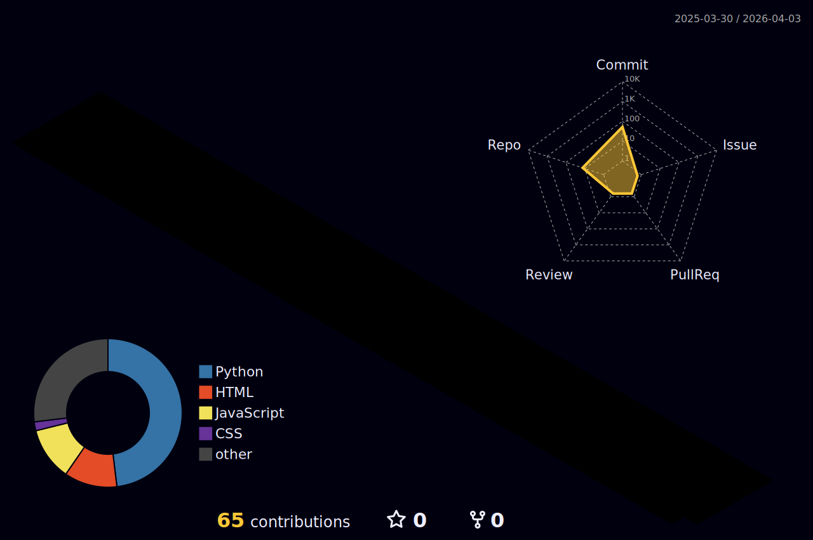

    

  

  

  

<h3 align="center"> 💻 Developer From Bengaluru, India</h3>  

  

  
  &nbsp;&nbsp;&nbsp;&nbsp;&nbsp;&nbsp;&nbsp;&nbsp;&nbsp;&nbsp;&nbsp;&nbsp;&nbsp;&nbsp;&nbsp;&nbsp;&nbsp;&nbsp;&nbsp;&nbsp;&nbsp;&nbsp;&nbsp;&nbsp;&nbsp;&nbsp;&nbsp;&nbsp;&nbsp;&nbsp;&nbsp;&nbsp;&nbsp;&nbsp;&nbsp;&nbsp;&nbsp;&nbsp;&nbsp;&nbsp;&nbsp;&nbsp;&nbsp;&nbsp;&nbsp;&nbsp;&nbsp;&nbsp;&nbsp;&nbsp;&nbsp;&nbsp;&nbsp;&nbsp;&nbsp;&nbsp;&nbsp;&nbsp;&nbsp;&nbsp;&nbsp;&nbsp;&nbsp;&nbsp;&nbsp;&nbsp;&nbsp;&nbsp;&nbsp;&nbsp;&nbsp;&nbsp;&nbsp;&nbsp;&nbsp;&nbsp;&nbsp;&nbsp;&nbsp;&nbsp;&nbsp;&nbsp;&nbsp;&nbsp;&nbsp;&nbsp;&nbsp;&nbsp;&nbsp;&nbsp;&nbsp;&nbsp;&nbsp;&nbsp;&nbsp;&nbsp;&nbsp;&nbsp;&nbsp;&nbsp;&nbsp;&nbsp;&nbsp;&nbsp;&nbsp;&nbsp;&nbsp;&nbsp;&nbsp;&nbsp;&nbsp;&nbsp;&nbsp;&nbsp;&nbsp;&nbsp;&nbsp;&nbsp;&nbsp;&nbsp;&nbsp;&nbsp;&nbsp;&nbsp;&nbsp;&nbsp;&nbsp;&nbsp;&nbsp;&nbsp;&nbsp;&nbsp;&nbsp;&nbsp;&nbsp;&nbsp;&nbsp;&nbsp;&nbsp;&nbsp;&nbsp;&nbsp;&nbsp;&nbsp;&nbsp;&nbsp;&nbsp;&nbsp;&nbsp;&nbsp;&nbsp;&nbsp;&nbsp;&nbsp;&nbsp;&nbsp;
  

  <b>Connect with me:</b>&nbsp;&nbsp;&nbsp;

  &nbsp;&nbsp;&nbsp;

  &nbsp;&nbsp;&nbsp;

  

#   Nandini Singh

##  About Me:

-  Pursuing **Master of Computer Applications (MCA)** at **Christ University, Bengaluru**
-  Former **Salesforce Developer Intern** at Arka Inventory
-  Passionate about building web applications that solve real-world problems
  
 **I'm currently working on:** Enhancing my skills in Machine Learning, Cloud Computing, and Full-Stack Development while building innovative projects at Christ University.   **I'm looking to collaborate on:** Full-stack web applications, ML-powered tools, data analysis projects, and open-source contributions that create real impact.   **I'm currently learning:** Advanced Machine Learning, Cloud Technologies (AWS), Data Structures & Algorithms, and modern web frameworks.   **Ask me about:** Python, Java, Salesforce, Web Development, Machine Learning, NLP-based applications, or building end-to-end projects.   **Fun fact:** I've been an emcee for numerous events at Christ University — I can code *and* command a stage! 🎤  

---

##  My favorite tools and technologies

<table align="center">
  <tr>
    <td align="center" width="96">
      
       Python
    </td>
    <td align="center" width="96">
        
       Java
    </td>
    <td align="center" width="96">
        
       JavaScript
    </td>
    <td align="center" width="96">
        
       MySQL
    </td>
    <td align="center" width="96">
        
       React
    </td>
    <td align="center" width="96">
        
       Docker
    </td>
    <td align="center" width="96">
        
       C
    </td>
  </tr>
  <tr>
    <td align="center" width="96">
        
       Kotlin
    </td>
    <td align="center" width="96">
        
       PHP
    </td>
    <td align="center" width="96">
        
       HTML5
    </td>
    <td align="center" width="96">
        
       CSS
    </td>
    <td align="center" width="96">
        
       MongoDB
    </td>
    <td align="center" width="96">
        
       GitHub
    </td>
    <td align="center" width="96"> 
        
       Git
    </td>
  </tr>
  <tr>
    <td align="center" width="96">
        
       FastAPI
    </td>
    <td align="center" width="96">
        
       Android Studio
    </td>
    <td align="center" width="96">
        
       Figma
    </td>
    <td align="center" width="96">
        
       Linux
    </td>
    <td align="center" width="96">
        
       VS Code
    </td>
    <td align="center" width="96">
        
       Postman
    </td>
    <td align="center" width="96">
        
       AWS
    </td>
  </tr>
</table>
  

---

##  Academic Projects

<table>
  <tr>
    <td width="50%">
      <h3 align="center"> DYSAID — Dyslexia Screening Web App</h3>
      

        Machine Learning web app using Decision Tree algorithm to identify risk of dyslexia in children below 12. Features data preprocessing, important feature selection, and model evaluation with a Streamlit interface for early, non-invasive screening.
      

      

        
        
        
      

    </td>
    <td width="50%">
      <h3 align="center"> NutriLens — Nutrition Label Analyzer</h3>
      

        Full-stack web application using OCR (Tesseract + OCR.space) to scan food packaging and extract nutritional data. Features NLP-based parsing, Random Forest ML model for health scoring, and a rule-based engine for verifying marketing claims.
      

      

        
        
        
        
      

    </td>
  </tr>
</table>

---

##  Research

-  **Unveiling Sentiment Trends:** An Approach to Utilize Machine Learning in Studying User Activities on New Social Applications — Research paper using decision tree algorithms for sentiment analysis across various datasets.

---

##  GitHub Stats:

   
  
   

  

 

  

##  GitHub Trophies

  

 

  

---

###  Random Dev Quote

---

---

##  Certifications & Badges

<!-- CREDLY_BADGES_START -->

  

<!-- CREDLY_BADGES_END -->

###  Other Certifications

  
   
  
   
  
   
  

---

  

